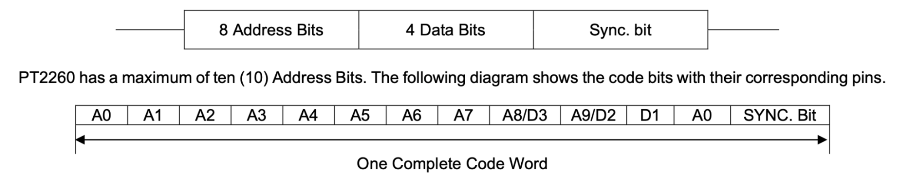
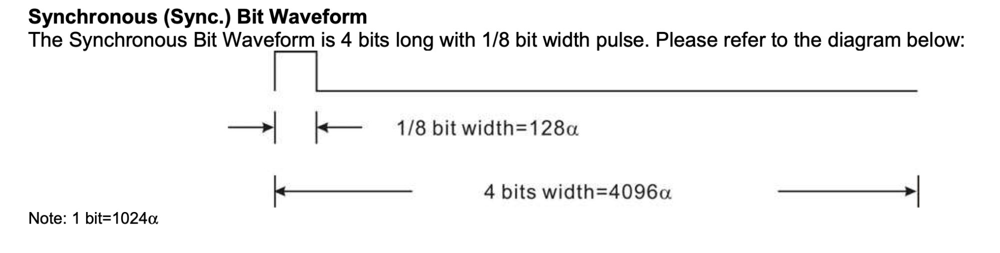
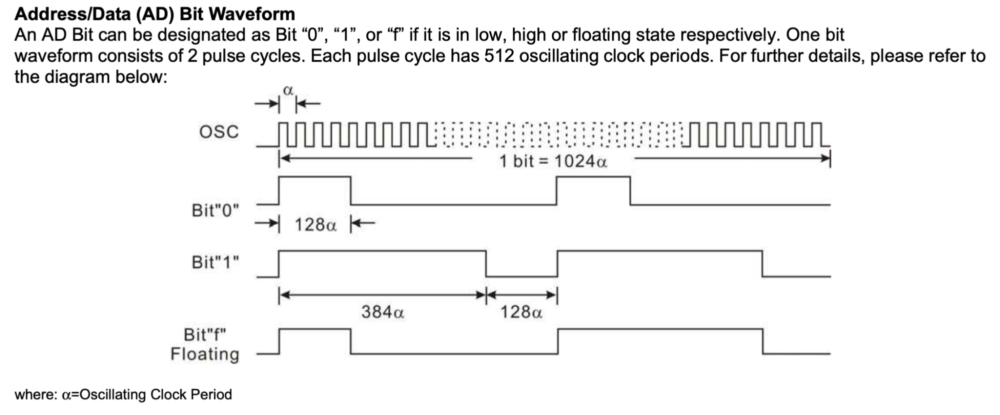
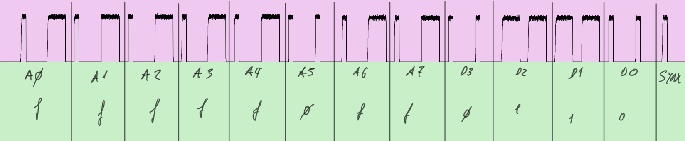
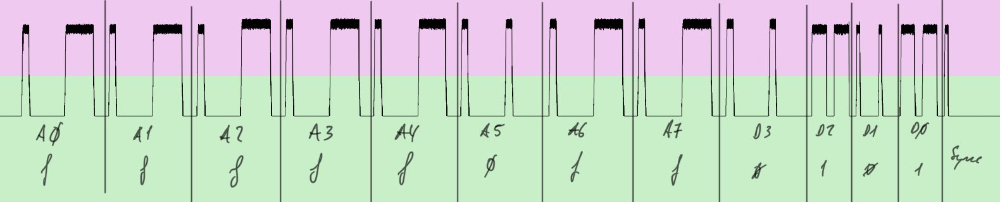

# Remote RF for HomeAssistant
RF remote based on RP2040 and CC1101. For those sub-gigahertz remotes laying around. 

Opening the remote control reveals that it has the integrated HS2260A, which is a clone of the PT2260.

The protocol used in wireless communications is explained in the latter's datasheet. In this case being at the frequency 433.92 MHz.

The format of the transmitted message is as follows:

As seen in the figure, the address is sent first, then the data and then a synchronization bit.

In the case of the command used in that case, the integrated one has the R4 termination, which indicates that it has 8 addressing bits, 4 data bits and one synchronization bit.

The symbolic representation of the address and data bits is according to the following figure:

The synchronization bit is as follows:

# DECODING MESSAGES

Using URH ([https://github.com/jopohl/urh](https://github.com/jopohl/urh)) the messages sent for each of the two operating buttons on the controller are decoded:

Off Button:

On button:

The smallest width is about 300 us. Which corresponds to one eighth of the bit width. With which:

* ‘f’  → 10001110 → 0x8e
* ‘0’ → 10001000 → 0x88
* ‘1’ → 11101110 → 0xee
* sync → 10000000 → 0x80

The sequences would be as follows (in hex):

<table>
  <tr>
   <td>A0
   </td>
   <td>A1
   </td>
   <td>A2
   </td>
   <td>A3
   </td>
   <td>A4
   </td>
   <td>A5
   </td>
   <td>A6
   </td>
   <td>A7
   </td>
   <td>D3
   </td>
   <td>D2
   </td>
   <td>D1
   </td>
   <td>D0
   </td>
   <td>SYN
   </td>
  </tr>
  <tr>
   <td colspan="13" >Off Button
   </td>
  </tr>
  <tr>
   <td>8e
   </td>
   <td>8e
   </td>
   <td>8e
   </td>
   <td>8e
   </td>
   <td>8e
   </td>
   <td>88
   </td>
   <td>8e
   </td>
   <td>8e
   </td>
   <td>88
   </td>
   <td>ee
   </td>
   <td>ee
   </td>
   <td>88
   </td>
   <td>80
   </td>
  </tr>
  <tr>
   <td colspan="13" >On button
   </td>
  </tr>
  <tr>
   <td>8e
   </td>
   <td>8e
   </td>
   <td>8e
   </td>
   <td>8e
   </td>
   <td>8e
   </td>
   <td>88
   </td>
   <td>8e
   </td>
   <td>8e
   </td>
   <td>88
   </td>
   <td>ee
   </td>
   <td>88
   </td>
   <td>ee
   </td>
   <td>80
   </td>
  </tr>
</table>

The silences between messages are approximately 5 ms, which with a resolution of 300 us corresponds to 16.6 zeros in binary or 4 bytes with a value of 0 (more are left for convenience).

# CC1101-TOOL

All credit goes to **Alam Laboda** for this amazing work at: https://github.com/mcore1976/cc1101-tool.

To configure and use this tool, the following commands are used:

setmodulation 2

ON button

Repeatedly:

addraw 0000000008e8e8e8e8e888e8e88ee88ee8000000

OOFF button

Repeatedly:

addraw 0000000008e8e8e8e8e888e8e88eeee888000000

playraw 300

# RP2040 MQTT

All credit goes to **Khoi Hoang** for this amazing work at: https://github.com/khoih-prog/AsyncMqttClient_Generic

Use of the example to connect to a mqtt topic and parse the commands as if a serial interface where used. This is implemented with the multicore capabilities of the RP2040.

# RP2040 Multicore and FIFO

All credit goes to **Earle F. Philhower, III** for this amazing work at: https://github.com/earlephilhower/arduino-pico

I´ve made an example to parse a pointer addres instead of whole commands to ease of use here (I might create a pull request): https://github.com/cegea/arduino-pico/blob/example/multicore_fifo/libraries/rp2040/examples/MulticoreFIFO/MulticoreFIFO.ino